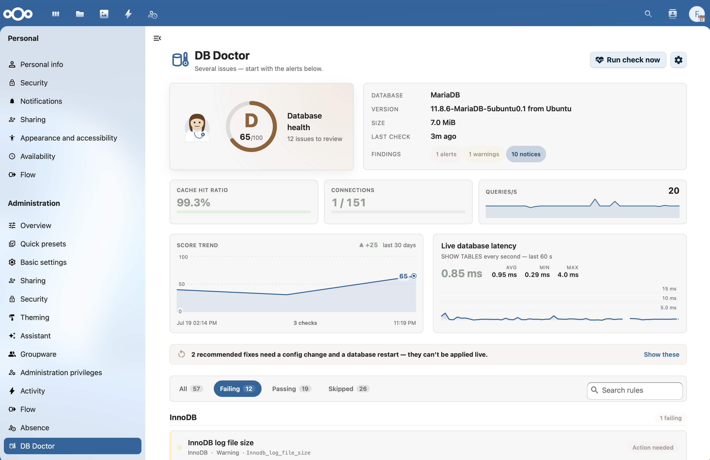
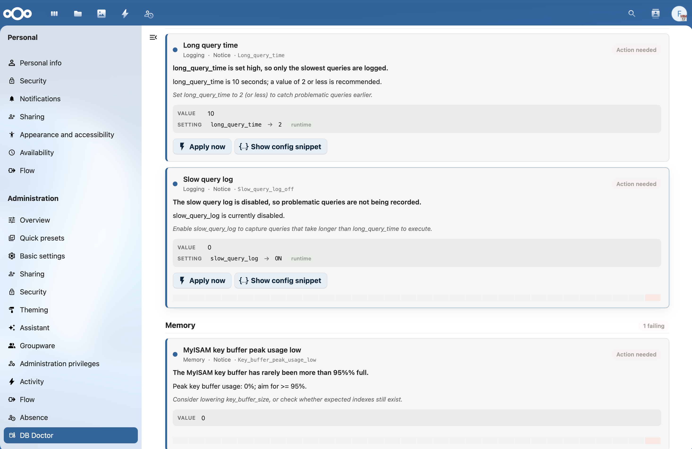
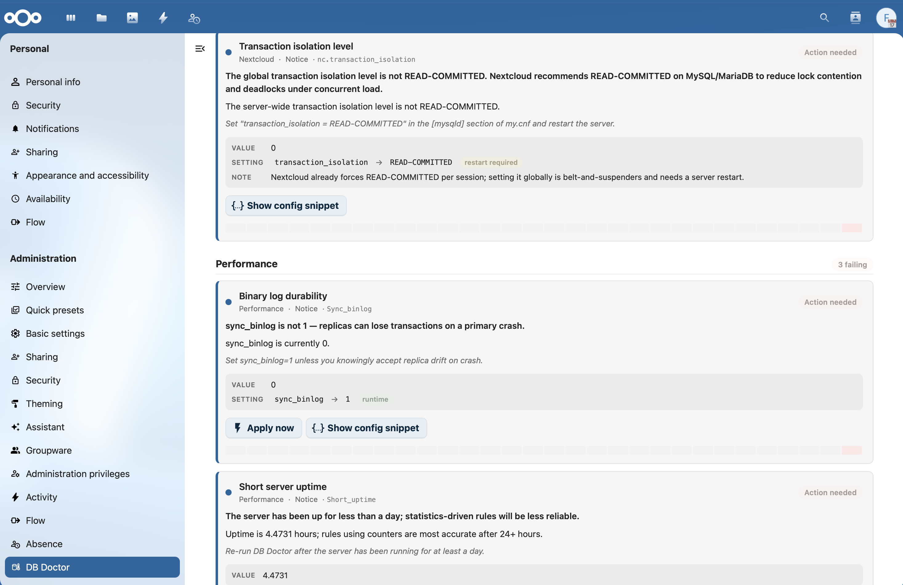
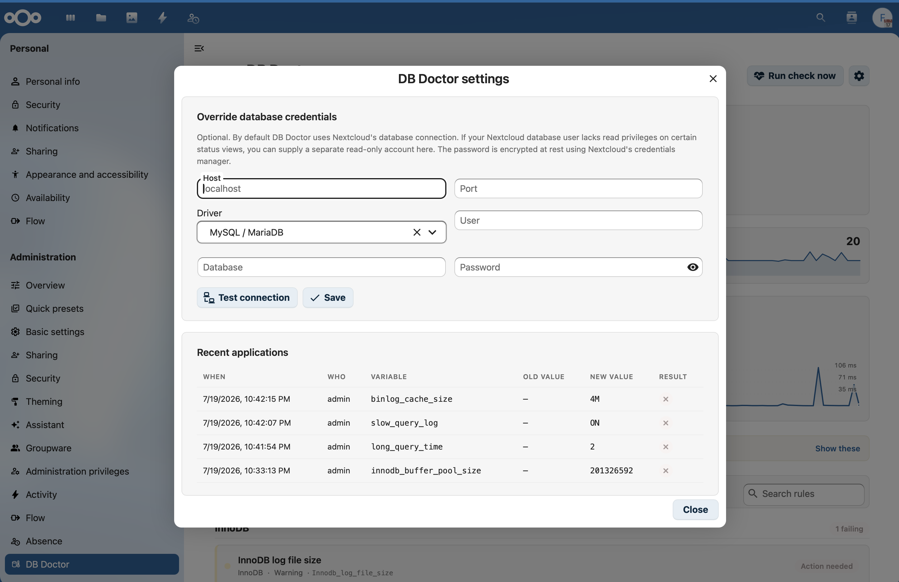

<!--
  - SPDX-FileCopyrightText: 2026 Nextcloud GmbH and Nextcloud contributors
  - SPDX-License-Identifier: AGPL-3.0-or-later
-->

<p align="center">
  
</p>

<h1 align="center">DB Doctor</h1>

<p align="center"><em>Your database, but with a regular check-up.</em></p>

DB Doctor audits the MySQL, MariaDB, or PostgreSQL database powering your Nextcloud against best-practice rules — ported from **phpMyAdmin's advisor**, plus curated PostgreSQL checks and a set of **Nextcloud-specific** schema checks — and presents the results as a friendly check-up: an at-a-glance health grade and a plain-English recommendation for every rule that fails. Apply safe runtime fixes with one click, or copy a `my.cnf` / `postgresql.conf` snippet for permanent changes.

It is **read-only by default**, **admin-only**, and **never phones home**.

## Screenshots

<p align="center">
  
</p>

<p align="center">
  
</p>

<p align="center">
  
</p>

<p align="center">
  
</p>

## Highlights

- **Health grade A–F** with a numeric score, and a plain-English issue + recommendation for every failing rule.
- **50+ MySQL/MariaDB rules** ported from phpMyAdmin's advisor (each keeps its upstream `id` so future syncs can be tracked), plus **curated PostgreSQL checks** (cache hit ratio, dead tuples, replication lag, connection saturation, long-running queries, sequential-scan hotspots).
- **Nextcloud-specific checks** that a generic advisor can't express:
  - missing indices / columns / primary keys — detected via the same events behind `occ db:add-missing-*`, so the recommended fix is exactly the `occ` command that resolves it;
  - 4-byte `utf8mb4` charset, InnoDB storage engine, and `READ-COMMITTED` transaction isolation.
- **One-click runtime fixes** for an allow-listed set of variables (`SET GLOBAL` / `ALTER SYSTEM`), with a downloadable config snippet for everything else. Every apply is recorded in an **audit log**.
- **Score trend chart** (30-day) and a **per-rule sparkline** so you can watch health climb over time.
- **Live metric tiles** (cache hit ratio, connection saturation, throughput) and a **live database-latency chart**, polled only while the page is visible.
- **Weekly automatic check-ups** that keep the trend data flowing and **notify admins** when database health declines.
- **Setup check** — the grade shows up in **Settings → Overview** where admins already look for problems.
- **`occ dbdoctor:check`** command with `--output=json` and Nagios-style exit codes for monitoring integration.
- **Reverted-fix detection** — a runtime fix lost to a database restart is flagged so you can make it permanent.
- **Uptime-aware** — ratio/rate rules are skipped until the server has enough uptime for their counters to mean anything, so you don't get false alarms right after a restart.
- **Optional override connection** — point DB Doctor at a separate (e.g. higher-privilege or read-only) database account without changing Nextcloud's main connection; the password is encrypted at rest.

## Requirements

- Nextcloud 33–35
- PHP 8.3 or newer
- MySQL 5.7+ / MariaDB 10.4+ / PostgreSQL 13+

## Installation

Install **DB Doctor** from the Nextcloud [app store](https://apps.nextcloud.com/), or build from source (below) and enable it:

```bash
sudo -u www-data php occ app:enable dbdoctor
```

Open it under **Settings → Administration → DB Doctor** and click **Run check now**.

## Command line

Run the advisor from the CLI — handy for cron and monitoring:

```bash
# Human-readable summary
sudo -u www-data php occ dbdoctor:check

# Machine-readable, for monitoring systems
sudo -u www-data php occ dbdoctor:check --output=json

# Only list failing rules
sudo -u www-data php occ dbdoctor:check --failing-only
```

Exit codes follow the Nagios convention: `0` OK, `1` warnings, `2` alerts, `3` unsupported/unknown.

## Configuration

Optional `config.php` settings:

```php
// Restrict which hosts an admin may point the override connection at
// (defense-in-depth against using the UI as an internal-network probe).
// When absent or empty, every host is allowed.
'dbdoctor.allowed_override_hosts' => ['db1.internal', '10.0.0.5'],
```

Disable the weekly automatic check-up:

```bash
sudo -u www-data php occ config:app:set dbdoctor scheduled_checks --value=no
```

## Building from source

```bash
composer install --no-dev --prefer-dist
npm ci
npm run build
```

Development helpers: `composer test` (PHPUnit), `npm test` (Vitest), `npm run lint`, `npm run watch`.

## Translations

Strings are translated on [Transifex](https://www.transifex.com/nextcloud/nextcloud/) via the
standard Nextcloud translation sync (`.tx/config` + `translationfiles/`). To contribute a
translation, join the Nextcloud Transifex team — compiled `l10n/*.js` / `l10n/*.json` files land
here automatically once the `dbdoctor` resource is activated for the sync bot.

## Credits

The MySQL/MariaDB rule set is ported from the **phpMyAdmin Advisor**, with each rule's upstream `id` preserved so future syncs can be tracked.

- Source: https://github.com/phpmyadmin/phpmyadmin/tree/master/src/Advisory

## License

DB Doctor is licensed under **AGPL-3.0-or-later**. The bundled phpMyAdmin advisor data is GPL-2.0-or-later (upward-compatible), retained intact and tracked via [REUSE.toml](REUSE.toml).
